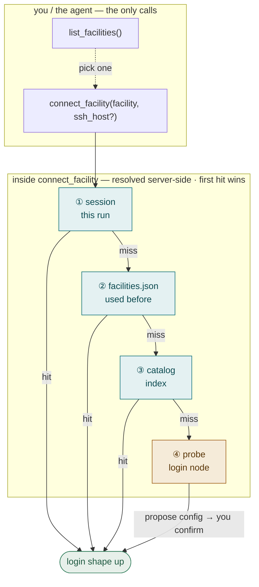

# hpc-bridge

**Drive real HPC from Claude Code.** A Claude Code plugin that stands up a *personal* Globus
Compute endpoint on a supercomputer's login node — so the agent can discover a machine, provision
compute (cost-gated), and run commands on a compute node, interactively, right in the conversation.

Globus Compute is the engine; hpc-bridge is the agent-facing packaging, the bootstrap, and the
runtime that makes a batch supercomputer feel like a REPL.

> **Not published yet.** Install locally with `claude --plugin-dir .` (see [Try it](#try-it)).

## Why

- **A cluster that feels like a REPL.** Ask Claude to bring up a node on Anvil or Polaris, run your
  job, and stop — no batch-script babysitting.
- **SSH once, then never.** The bootstrap is a single SSH; everything after — *discovery as well as
  compute* — rides Globus Compute's scoped-token path. No re-auth mid-session, which is what makes
  Duo/MFA facilities painful.
- **Cost-gated by design.** A billed block won't start until you confirm the spend, and idle blocks
  self-release. The agent surfaces your allocation balance before it asks.

## How it works

One idea holds the whole thing together: **SSH is a one-time bootstrap; everything after rides the
endpoint.** `connect_facility` is the entry point — it brings up a free login-node worker, and both
discovery *and* compute then go through it, never a fresh SSH. How it *reaches* a machine depends on
what it already knows:



Rungs ①–③ cost **no SSH** (teal); only a brand-new, un-indexed machine falls to the **probe** (amber).
A machine you've used before hits ② — reconnecting **zero-SSH** from a local cache. From *login shape
up* the rest is the workflow: discover partitions → gate the spend → provision the block → run → stop
(walked through in [Try it](#try-it)).

Eight MCP tools drive it — `connect_facility`, `list_facilities`, `ensure_endpoint_up`, `run_shell`,
`login_shell`, `reset_session`, `stop_endpoint`, `teardown_endpoint`. The interactive version of this
diagram, the warmth canary, and the cost model live in the [docs](#docs).

## Try it

You'll need Python 3.11+, [`uv`](https://docs.astral.sh/uv/), SSH access to an HPC login node (in
your `~/.ssh/config`), and a `globus-compute-endpoint login`.

```bash
uv sync --extra dev
uv run pytest -q          # unit tests (hermetic — no cluster needed)
claude --plugin-dir .     # load hpc-bridge into Claude Code
```

Then just ask, in Claude Code:

> *"Connect me to the cluster at `login.example.edu`, bring up a compute node, and run `hostname` on it."*

The agent brings up the login node, discovers the partitions, shows you your allocations, asks you to
confirm the spend, provisions a block, runs — then `stop_endpoint` releases it. Next time you connect
to that cluster, the reconnect is zero-SSH.

Config is **discovered, not hand-written**: SSH identity comes from your `~/.ssh/config` (or
`HPC_BRIDGE_SSH_USER` / `HPC_BRIDGE_SSH_KEY`), and the facility's own settings are probed on first
connect. The full env-var reference is in the docs.

## Docs

The **[vault](docs/hpc-bridge-vault/Home.md)** (an Obsidian vault at `docs/hpc-bridge-vault/`) is the
map — start at **Home**. It covers the concepts (the two-channel architecture, the canary, cost
control), a note per module, the tool reference, and where the design is heading. Open it in Obsidian
for the linked graph, or browse the markdown on GitHub.

## Status

Actively developed, **not yet published**. Proven live on **Purdue Anvil** and **Midway** (Slurm),
**ALCF Polaris** (PBS), and a lab Globus cluster — the agent stands up an endpoint, runs on a compute
node, and releases the allocation. `uv run pytest -q` is green.

## Security

The hot path carries a scoped Globus Auth token, **never SSH material**; SSH is key-only and used
only to bootstrap. An interactive login (a password or Duo passcode) is **never handled by the
agent** — hpc-bridge relays a command for *you* to run in your own terminal. The honest caveats — the
"the agent runs as you" prompt-injection surface, and credential brokering for OTP facilities — are
tracked in the docs. **Don't point this at a production facility yet.**
