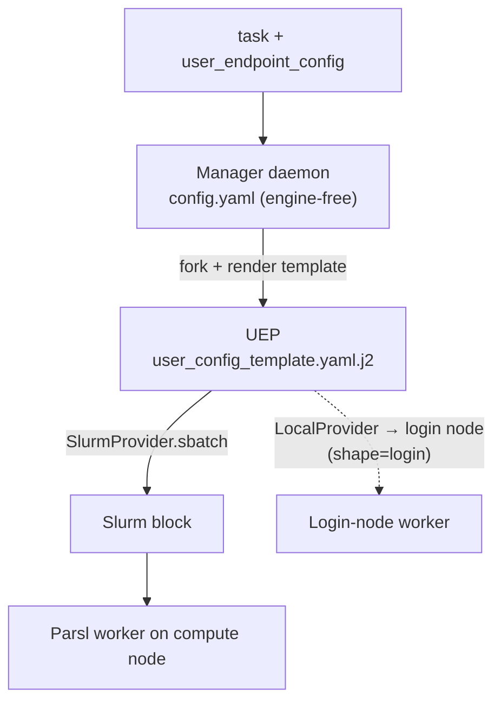

# MEP & templated endpoints

> [!abstract] In one line
> One endpoint = a **manager daemon** on the login node plus a **Jinja config template** rendered *per task* into a User Endpoint Process; that UEP's Parsl provider `sbatch`s a block and runs the work on a compute node.

## What it is

The endpoint is a Globus Compute **v4 Multi-User Endpoint (MEP)** run in *personal / single-user* mode. "Multi-user" here names the **manager + templated-UEP** architecture — *not* identity mapping:

- **Manager** — a detached daemon on one login node. Its `config.yaml` is **engine-free** (just `display_name`, `amqp_port`). It registers with Globus and listens on AMQP.
- **UEP (User Endpoint Process)** — forked by the manager *per task*. Its engine + provider come from `user_config_template.yaml.j2`, rendered from the `user_endpoint_config` dict the task carries.
- **Block → compute node** — the UEP's Parsl provider (`SlurmProvider` / `LocalProvider`) submits a scheduler block; a Parsl worker starts on the compute node and connects back over the high-speed `interface` (see [[Two-channel architecture]]).

## Shapes: one endpoint, many configs

`user_endpoint_config` is a named bag of template vars — a **shape** ([[shapes]]). `shape="slurm"` renders a `SlurmProvider` (billed compute block); `shape="login"` renders a `LocalProvider` (a free process on the login node — also the no-SSH discovery channel). See [[Resource shapes & the spend floor]].

## How it shows up in the code

- The template + default vars: `SlurmFacility.config_template()` ([[facility-remote]], `remote.py:378`).
- The manager + UEP config written at provision: `provision()` (`remote.py:512`).
- The shape → vars mapping: `shape_config()` ([[shapes]]).

> [!warning] `config.yaml` must be engine-free
> `gce start` runs an *EndpointManager*; if the engine is in `config.yaml` it fails — the engine must live in the UEP template (the v4 manager+template model). `configure` also forces `--multi-user false`; the default auto-selects an identity-mapping MEP from POSIX capabilities.

> [!warning] Branch on the boolean `is_slurm`, never a string compare
> The manager runs `user_opts` through `_sanitize_user_json`, which `json.dumps`'s every *string* (so `"SlurmProvider"` arrives as `'"SlurmProvider"'`). A template `` then silently fails and drops the whole provider block. Booleans pass through untouched, so the template branches on the `is_slurm` bool ([[shapes]]). This was a real, hard-to-see bug ([#5](https://github.com/ryanchard/hpc-bridge/issues/5)).

> [!note] `run_in_sandbox: true` — and why it's safe
> The engine sets `run_in_sandbox: true`: ShellFunctions expect a sandbox, and without it every task logs *"Task sandboxing will not work due to endpoint misconfiguration."* Sandboxing runs each task in `tasks_working_dir/<TASK_UUID>` — harmless here because the [[Session continuity|session shim]] immediately `cd`s to an absolute `<scratch>/sessions/<id>` path, overriding the sandbox landing dir. The config is written at `configure` time, so a flip only takes effect on a **freshly bootstrapped** endpoint, not a reused one.

## See also
[[Resource shapes & the spend floor]] · [[shapes]] · [[facility-remote]] · [[Standing up the endpoint]] · [[Two-channel architecture]]
