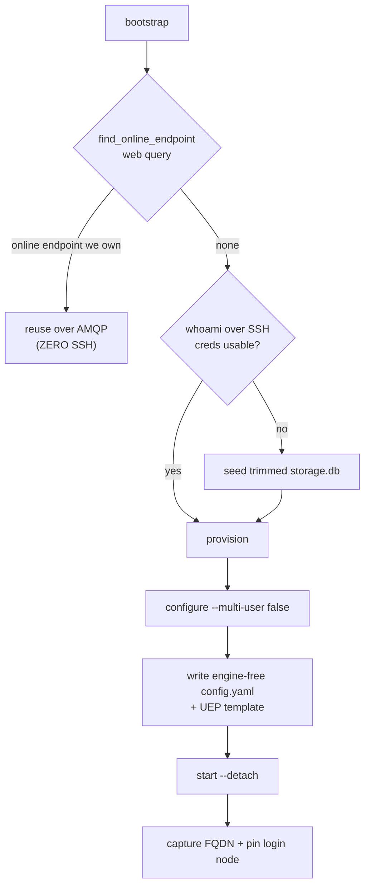

# Standing up the endpoint

> [!abstract] In one line
> First connect: **reuse an already-online endpoint over the web (zero SSH)**, else SSH once to seed credentials, write the manager + UEP config, `start` the daemon detached, and **pin** the login node it landed on.

## The flow

`SlurmFacility.bootstrap()` ([[facility-remote]], `remote.py:544`) is the entry, and it is **reuse-or-SSH**:

- **Reuse first** (`find_online_endpoint`, `remote.py:643`) — a still-running endpoint from a prior session is reused over AMQP with no SSH. This is the [[Two-channel architecture|SSH-once]] keystone, and the reattach is now **surfaced** on the connect result (`ConnectFacilityResult.reused`) instead of being silent ([#20](https://github.com/ryanchard/hpc-bridge/issues/20)).
- **Credentials** — seeded only if the remote can't already authenticate (`whoami`). See [[Credential seeding]].
- **Provision** (`remote.py:585`) — `configure` (forced `--multi-user false`) → write the engine-free manager `config.yaml` + the [[MEP & templated endpoints|UEP template]] → `start --detach`.
- **Pin** — record the login node so the next session reconnects directly ([[state]]).

> [!warning] Login-node pinning
> The manager lives on ONE login node, but the SSH alias round-robins. `start` (`remote.py:315`) captures the FQDN *in the same SSH connection* that launches the daemon — a separate `hostname -f` could resolve a different node and orphan the manager on teardown. The FQDN is stored by [[state]]'s `LoginNodeStore`; the CLI `rebind`s there next session — **unless `_routable_pin` drops it as non-routable** (an internal `.local`/`.internal` name, or a management-plane name like Aurora's `aurora-uan-0009.hostmgmt.cm.aurora.alcf.anl.gov`), in which case it stays on the alias ([[facility-remote]], [#33](https://github.com/ryanchard/hpc-bridge/pull/33)).

> [!note] Idempotent
> Bootstrap reuses a running endpoint, seeds credentials only when absent, and re-writes config on every provision so the current profile always applies.

## See also
[[Two-channel architecture]] · [[Credential seeding]] · [[MEP & templated endpoints]] · [[facility-remote]] · [[state]] · [[Discovery today]]
