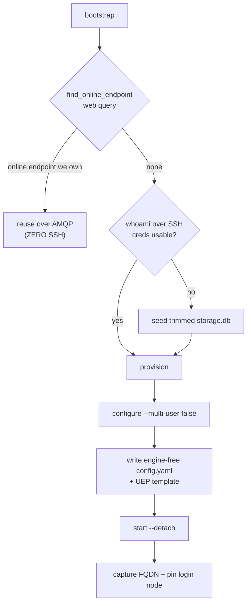

# Standing up the endpoint

> [!abstract] In one line
> First connect: **reuse an already-online endpoint over the web (zero SSH)**, else SSH once to seed credentials, write the manager + UEP config, `start` the daemon detached, and **pin** the login node it landed on.

## The flow

`SlurmFacility.bootstrap()` ([[facility-remote]], `remote.py:714`) is the entry, and it is **reuse-or-SSH**:

```mermaid
flowchart TD
  A[bootstrap] --> B{find_online_endpoint<br/>web query}
  B -- "online endpoint we own" --> R["reuse over AMQP<br/>(ZERO SSH)"]
  B -- none --> C{whoami over SSH<br/>creds usable?}
  C -- no --> S[seed trimmed storage.db]
  C -- yes --> P
  S --> P[provision]
  P --> P1[configure --multi-user false]
  P1 --> P2["write engine-free config.yaml<br/>+ UEP template"]
  P2 --> P3[start --detach]
  P3 --> P4[capture FQDN + pin login node]
```

- **Reuse first** (`find_online_endpoint`, `remote.py:821`) — a still-running endpoint from a prior session is reused over AMQP with no SSH. This is the [[Two-channel architecture|SSH-once]] keystone, and the reattach is now **surfaced** on the connect result (`ConnectFacilityResult.reused`) instead of being silent ([#20](https://github.com/ryanchard/hpc-bridge/issues/20)).
- **Credentials** — seeded only if the remote can't already authenticate (`whoami`). See [[Credential seeding]].
- **Provision** (`remote.py:753`) — a locally-"Running" endpoint is **re-adopted with no probe** (a probe can't tell a cold worker from a hang); a fresh name is `configure`d (forced `--multi-user false`); a stopped/configured one being **re-`start`ed first has its stale per-UEP `daemon.pid` files cleared** (scoped to the endpoint UUID) so the rebuilt worker can't hit "Another instance is running" → exit 73 ([#37](https://github.com/ryanchard/hpc-bridge/issues/37)). Then write the engine-free manager `config.yaml` + the [[MEP & templated endpoints|UEP template]] → `start --detach`.
- **Pin** — record the login node so the next session reconnects directly ([[state]]).

> [!warning] Login-node pinning
> The manager lives on ONE login node, but the SSH alias round-robins. `start` (`remote.py:386`) captures the FQDN *in the same SSH connection* that launches the daemon — a separate `hostname -f` could resolve a different node and orphan the manager on teardown. The FQDN is stored by [[state]]'s `LoginNodeStore`; the CLI `rebind`s there next session — **unless `_routable_pin` drops it as non-routable** (an internal `.local`/`.internal` name, or a management-plane name like Aurora's `aurora-uan-0009.hostmgmt.cm.aurora.alcf.anl.gov`), in which case it stays on the alias ([[facility-remote]], [#33](https://github.com/ryanchard/hpc-bridge/pull/33)).

> [!note] Idempotent
> Bootstrap reuses a running endpoint, seeds credentials only when absent, and re-writes config on every provision so the current profile always applies.

> [!note] A facility MEP skips all of this
> A `compute_mep_uuid` entry binds a [[facility-mep|`MEPFacility`]] whose `provision` just returns the catalogued UUID with `reused=True` — the facility runs the manager and maps our Globus identity to a local account, so there is nothing to seed, configure or start, and `connect_facility` only *attaches* (`_connect_mep`, [[server]]).

## What a newcomer sees when SSH fails

The bootstrap's first SSH is where a stranger with no account on the facility fails, and the raw error named an internal step (`seed storage.db (mkdir) failed: u@host: Permission denied (publickey,…)`). `_explain_provision_error` ([[server]], `server.py:170`) rewrites it into what they can act on: **`NO SSH ACCESS to <host> as <user>`** — which host and login name were tried, *where the name came from* (`HPC_BRIDGE_SSH_USER`, `~/.ssh/config`, or nowhere ⇒ the local username), the remedies (put `User`/`IdentityFile` in `~/.ssh/config` or set the env overrides; on an MFA facility pre-open a session), and "nothing was started or billed" — or **`CANNOT REACH <host>`** for a resolve/timeout/refused failure, or a hint to shorten `HPC_BRIDGE_STATE_DIR` for `ControlPath too long` (found on the stranger's walk, [#50](https://github.com/ryanchard/hpc-bridge/issues/50)). A host that *offers* an interactive method instead raises `NeedsPreauth` → `needs_preauth` ([[MFA and interactive SSH auth]]). On `main` this explanation covers the bootstrap path; the discovery-probe path (`_propose_or_ask`) still returns the raw `discovery over SSH to … failed` text — PR [#51](https://github.com/ryanchard/hpc-bridge/issues/51) (open) routes it through the same explainer.

## See also
[[Two-channel architecture]] · [[Credential seeding]] · [[MEP & templated endpoints]] · [[facility-remote]] · [[facility-mep]] · [[state]] · [[Discovery today]] · [[login]]
