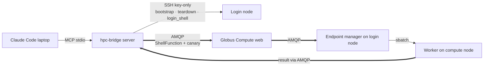

# Two-channel architecture

> [!abstract] In one line
> SSH is a **one-time control channel** (bootstrap · teardown · read-only discovery before an endpoint exists); all *work* rides **Globus Compute over AMQP** — a scoped Globus token, never SSH material.

## What & why

hpc-bridge keeps two strictly separate paths to a facility:

- **Control plane — SSH (key-only).** Used *only* to stand up / tear down the endpoint, and for read-only discovery when no endpoint exists yet. Minimised to a single bootstrap, because every fresh SSH risks an interactive re-auth on an MFA facility.
- **Hot path — Globus Compute / AMQP.** Every `run_shell` and the warmth *canary* go over Globus Compute's AMQP path, carrying a scoped Globus Auth token. No SSH credential ever touches the work path.

## How it shows up in the code

- **SSH transport:** `ssh_exec()` ([[facility-remote]], `remote.py:55`) — key-only, `BatchMode`, reaps the child on timeout. Drives `bootstrap`, `teardown`, and `login_exec` (the `login_shell` tool).
- **AMQP hot path:** `GlobusRunner` ([[runner]]) submits a `ShellFunction` through a long-lived Globus Compute `Executor`; the same Executor runs the canary ([[Warmth, the canary & cold-start]]). Reached from `run_shell` via [[server]] → `_run_shell`.

> [!warning] The load-bearing invariant
> The hot path carries a **scoped Globus Auth token, never SSH material**. SSH is key-only (`BatchMode`, `IdentitiesOnly`) and used only to bootstrap/teardown. Routing discovery through the login-*shape* (AMQP) rather than `login_shell` (SSH) is what makes a reconnect session SSH-free — see [[Discovery today]].

## See also
[[Standing up the endpoint]] · [[MEP & templated endpoints]] · [[Credential seeding]] · [[server]] · [[facility-remote]] · [[runner]]
