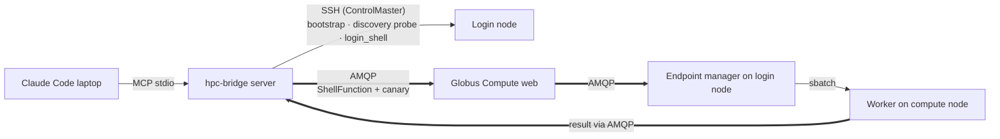

# Two-channel architecture

> [!abstract] In one line
> SSH is the **control plane** — bootstrap, the un-indexed-facility **discovery probe**, and the `login_shell` escape hatch — reused over **one authenticated connection** (ControlMaster: authenticate once, not once-per-call). All *work* — `run_shell`, the warmth canary, **and releasing the block on `stop`** — rides **Globus Compute over AMQP**, a scoped Globus token, never SSH material. (Catalogued-facility discovery also rides AMQP, via the login shape.)

## What & why

hpc-bridge keeps two strictly separate paths to a facility:

- **Control plane — SSH.** Used for the irreducible: the bootstrap, the **un-indexed-facility discovery probe** (raw SSH, *before* an endpoint exists — `discover_facility_details`), and the `login_shell` escape hatch. SSH identity defers to your `~/.ssh/config` (key optional), and a **ControlMaster** multiplexes every call over **one authentication** — so an MFA facility prompts once, not per-call (reuse, not avoidance). (An *explicit full teardown* — `gce stop` the manager, since you can't stop the daemon through itself — also needs SSH, but `stop_endpoint` doesn't do that; it releases the block over AMQP and leaves the manager up for reuse.)
- **Hot path — Globus Compute / AMQP.** Every `run_shell`, the warmth *canary*, **and the block-release on `stop_endpoint`** ride Globus Compute's AMQP path (the login/compute worker), carrying a scoped Globus Auth token. No SSH credential ever touches the work path. **Once an endpoint exists, AMQP is the first port of call for runtime comms** — compute, catalogued-facility discovery (the login shape), and the stop's `scancel`. The one exception is *bootstrapping an un-indexed facility*: discovering its config necessarily happens over raw SSH *before* the endpoint is up. The login-node endpoint exists precisely so that, once up, we talk to the cluster over Compute, not a fresh SSH.

## How it shows up in the code

- **SSH transport:** `ssh_exec()` ([[facility-remote]]) — `BatchMode`, ControlMaster-multiplexed, key optional (defers to `~/.ssh/config`), reaps the child on timeout. Drives `bootstrap`, the un-indexed `discover_facility_details` ([[discovery]]) probe, `login_exec` (the `login_shell` tool), and — only for an *explicit full teardown* — `gce stop`/`cancel_blocks` (the facility's `teardown()`, **not** called by `stop_endpoint`). The stop's block-release rides AMQP (`_release_blocks_over_login`, [[server]]).
- **AMQP hot path:** `GlobusRunner` ([[runner]]) submits a `ShellFunction` through a long-lived Globus Compute `Executor`; the same Executor runs the canary ([[Warmth, the canary & cold-start]]). Reached from `run_shell` via [[server]] → `_run_shell`.

> [!warning] The load-bearing invariant
> The hot path carries a **scoped Globus Auth token, never SSH material** — the invariant that doesn't move. SSH is the control plane (bootstrap, the un-indexed discovery probe, the `login_shell` escape hatch), reused over one ControlMaster authentication. Routing *work* — `run_shell`, the canary, the stop's block-release — and *catalogued-facility discovery* through AMQP is what keeps a warm session SSH-free once the endpoint is up — see [[Discovery today]].

## See also
[[Standing up the endpoint]] · [[MEP & templated endpoints]] · [[Credential seeding]] · [[server]] · [[facility-remote]] · [[runner]]
