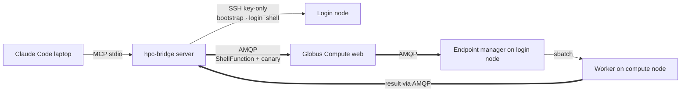

# Two-channel architecture

> [!abstract] In one line
> SSH is a **one-time bootstrap** (+ the `login_shell` cold-start escape hatch); all *work* — discovery, compute, **and releasing the block on `stop`** — rides **Globus Compute over AMQP**, a scoped Globus token, never SSH material.

## What & why

hpc-bridge keeps two strictly separate paths to a facility:

- **Control plane — SSH (key-only).** Used *only* for the irreducible: the one-time bootstrap and the `login_shell` cold-start escape hatch. Minimised because every fresh SSH risks an interactive re-auth on an MFA facility. (An *explicit full teardown* — `gce stop` the manager, since you can't stop the daemon through itself — also needs SSH, but `stop_endpoint` doesn't do that; it releases the block over AMQP and leaves the manager up for reuse.)
- **Hot path — Globus Compute / AMQP.** Every `run_shell`, the warmth *canary*, **and the block-release on `stop_endpoint`** ride Globus Compute's AMQP path (the login/compute worker), carrying a scoped Globus Auth token. No SSH credential ever touches the work path. **AMQP is the first port of call for *all* runtime cluster comms** — discovery, compute, and the stop's `scancel`. The login-node endpoint exists precisely so we talk to the cluster over Compute, not a fresh SSH.

## How it shows up in the code

- **SSH transport:** `ssh_exec()` ([[facility-remote]]) — key-only, `BatchMode`, reaps the child on timeout. Drives `bootstrap`, `login_exec` (the `login_shell` tool), and — only for an *explicit full teardown* — `gce stop`/`cancel_blocks` (the facility's `teardown()`, **not** called by `stop_endpoint`). The stop's block-release rides AMQP (`_release_blocks_over_login`, [[server]]).
- **AMQP hot path:** `GlobusRunner` ([[runner]]) submits a `ShellFunction` through a long-lived Globus Compute `Executor`; the same Executor runs the canary ([[Warmth, the canary & cold-start]]). Reached from `run_shell` via [[server]] → `_run_shell`.

> [!warning] The load-bearing invariant
> The hot path carries a **scoped Globus Auth token, never SSH material**. SSH is key-only (`BatchMode`, `IdentitiesOnly`) and used only for the one-time bootstrap (+ the `login_shell` escape hatch). Routing discovery *and the stop's block-release* through AMQP is what keeps a warm session entirely SSH-free after that bootstrap — see [[Discovery today]].

## See also
[[Standing up the endpoint]] · [[MEP & templated endpoints]] · [[Credential seeding]] · [[server]] · [[facility-remote]] · [[runner]]
