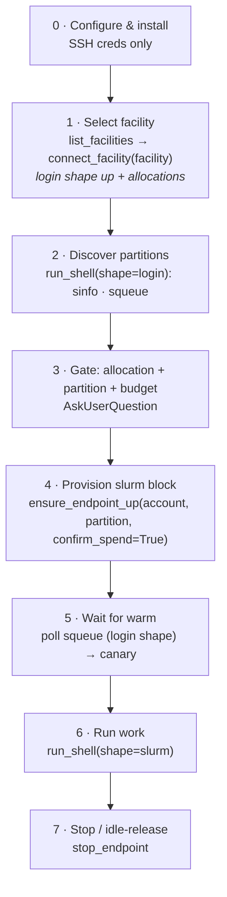

# Happy path

> [!abstract] In one line
> The canonical end-to-end flow the system implements — *bring up a compute node and run on it* — and the same path the `driving-hpc` skill ([[Plugin packaging]]) drives. Each step links to the concept that explains it.

This is the **implemented spine** — machine + allocation are now agent-selected from the [[Facility catalog|catalog]]. What's *next* (the fuller discovery cascade) lives in `Planned/` — see [[Globus index discovery channel]].

## The steps

0. **Configure & install** — set the SSH creds (key + login name); load the plugin. The *machine* is chosen at runtime, not pinned by env. → [[Configuration]] · [[Plugin packaging]]
1. **Select the facility** — `list_facilities()` browses the [[Facility catalog|catalog]]; `connect_facility(facility)` brings up the **free login shape** (reuse over web, else one SSH bootstrap; seed creds; pin the login node) and lists the user's allocations. → [[Facility catalog]] · [[Standing up the endpoint]] · [[Credential seeding]]
2. **Discover partitions** — `run_shell(shape="login")` runs `sinfo`/`squeue` over AMQP, **no SSH**. → [[Discovery today]]
3. **Gate** — present the allocations (balance) + partitions (live idle) + estimated cost; the human picks. → [[Resource shapes & the spend floor]]
4. **Provision the billed block** — `ensure_endpoint_up(shape="slurm", account=…, partition=…, confirm_spend=True)`; the spend floor blocks an *unconfirmed* start. → [[Resource shapes & the spend floor]] · [[MEP & templated endpoints]]
5. **Wait for warm** — poll `squeue` via the login shape until `RUNNING`, then one canary confirms a *live worker*. → [[Warmth, the canary & cold-start]]
6. **Run work** — `run_shell(shape="slurm")`; cwd/env persist across calls per session. → [[The MCP tools]] · [[Session continuity]]
7. **Stop / idle-release** — `stop_endpoint`, or the block self-releases when idle. → [[Cost control]]

> [!note] Keep this consistent with the skill
> `skills/driving-hpc/SKILL.md` is the *operational* version of this path (the agent's recipe); this note is the *explanatory* map. Change one ⇒ change the other.

## When the happy path doesn't hold
Discovery degrades — index down → login-probe → human. The catalog resolver + agentic selection are **built** ([[Facility catalog]]); the *fuller* degraded cascade (explicit human-Socratic fallback, ablation, resolution trace) is the [[Globus index discovery channel|next thread]]. Current behaviour: [[Discovery today]].

## See also
[[Home]] · [[Two-channel architecture]] · [[Discovery today]] · [[The MCP tools]]
