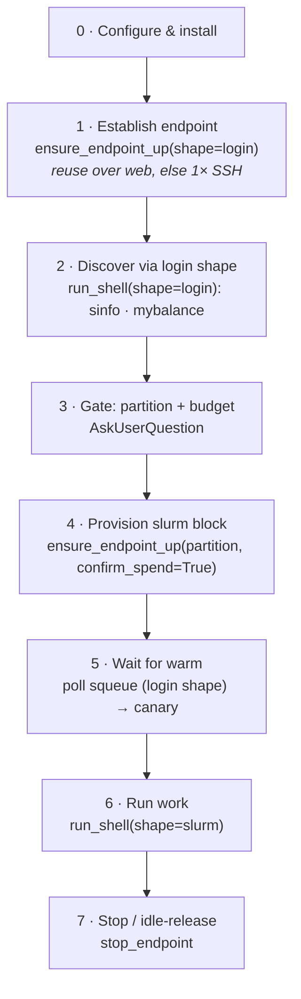

# Happy path

> [!abstract] In one line
> The canonical end-to-end flow the system implements — *bring up a compute node and run on it* — and the same path the `driving-hpc` skill ([[Plugin packaging]]) drives. Each step links to the concept that explains it.

This is the **implemented spine**. What's *next* lives in `Planned/` — see [[Globus index discovery channel]].

## The steps

0. **Configure & install** — set the facility env vars; load the plugin. → [[Configuration]] · [[Plugin packaging]]
1. **Establish the endpoint** (`shape="login"`) — reuse an online endpoint over the web (zero SSH), else one SSH bootstrap; seed credentials if needed; pin the login node. → [[Standing up the endpoint]] · [[Two-channel architecture]] · [[Credential seeding]]
2. **Discover through the endpoint** — `run_shell(shape="login")` runs `sinfo`/`mybalance`/`squeue` over AMQP, **no SSH**. → [[Discovery today]]
3. **Gate** — present partitions (live idle) + balance + estimated cost; the human picks. → [[Resource shapes & the spend floor]]
4. **Provision the billed block** — `ensure_endpoint_up(shape="slurm", partition=…, confirm_spend=True)`; the spend floor blocks an *unconfirmed* start. → [[Resource shapes & the spend floor]] · [[MEP & templated endpoints]]
5. **Wait for warm** — poll `squeue` via the login shape until `RUNNING`, then one canary confirms a *live worker*. → [[Warmth, the canary & cold-start]]
6. **Run work** — `run_shell(shape="slurm")`; cwd/env persist across calls per session. → [[The five MCP tools]] · [[Session continuity]]
7. **Stop / idle-release** — `stop_endpoint`, or the block self-releases when idle. → [[Cost control]]

> [!note] Keep this consistent with the skill
> `skills/driving-hpc/SKILL.md` is the *operational* version of this path (the agent's recipe); this note is the *explanatory* map. Change one ⇒ change the other.

## When the happy path doesn't hold
Discovery degrades — index down → login-probe → human — and the per-facility shape is still **hardcoded** today. That generalization is the [[Globus index discovery channel|next thread]]; current behaviour is [[Discovery today]].

## See also
[[Home]] · [[Two-channel architecture]] · [[Discovery today]] · [[The five MCP tools]]
