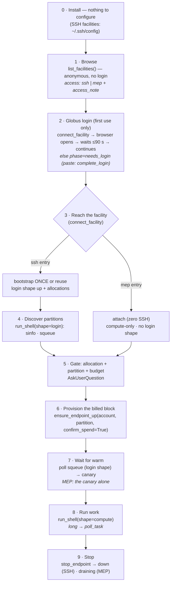

# Happy path

> [!abstract] In one line
> The canonical end-to-end flow the system implements — *a first-time user, with no configuration, brings up a compute node and runs on it* — and the same path the `driving-hpc` skill ([[Plugin packaging]]) drives. Each step links to the concept that explains it.

This is the **implemented spine** — the machine comes from the public [[Facility catalog|registry]] (or is discovered by probing an un-indexed one, [[discovery]]), the Globus login happens in-terminal ([[login]]), and the facility is reached one of two ways: **SSH once** to stand up a personal endpoint, or **zero SSH** by attaching to the facility's own multi-user endpoint ([[facility-mep]]). What remains (ablation flags, resolution trace, write-back) lives in `Planned/` — see [[Globus index discovery channel]].

```mermaid
flowchart TD
  C["0 · Install — nothing to configure<br/>(SSH facilities: ~/.ssh/config)"] --> L["1 · Browse<br/>list_facilities() — anonymous, no login<br/><i>access: ssh | mep + access_note</i>"]
  L --> A["2 · Globus login (first use only)<br/>connect_facility → browser opens → waits ≤90 s → continues<br/><i>else phase=needs_login (paste: complete_login)</i>"]
  A --> S{"3 · Reach the facility<br/>(connect_facility)"}
  S -- "ssh entry" --> B["bootstrap ONCE or reuse<br/>login shape up + allocations"]
  S -- "mep entry" --> M["attach (zero SSH)<br/>compute-only · no login shape"]
  B --> D["4 · Discover partitions<br/>run_shell(shape=login): sinfo · squeue"]
  D --> G["5 · Gate: allocation + partition + budget<br/>AskUserQuestion"]
  M --> G
  G --> P["6 · Provision the billed block<br/>ensure_endpoint_up(account, partition, confirm_spend=True)"]
  P --> W["7 · Wait for warm<br/>poll squeue (login shape) → canary<br/><i>MEP: the canary alone</i>"]
  W --> R["8 · Run work<br/>run_shell(shape=compute)<br/><i>long → poll_task</i>"]
  R --> T["9 · Stop<br/>stop_endpoint → down (SSH) · draining (MEP)"]
```

## The steps

0. **Install — nothing to configure.** Load the plugin; the registry id is built in and the Globus login is obtained in-terminal, so a stranger needs **no** env var and no prior CLI login. An SSH facility takes its login name + key from your `~/.ssh/config` (optional `HPC_BRIDGE_SSH_USER`/`KEY` overrides). The *machine* is chosen at runtime, not pinned by env. → [[Configuration]] · [[Plugin packaging]]
1. **Browse** — `list_facilities()` reads the public registry **anonymously** (no login, no config) and returns agent-safe summaries that say **how you get in**: `access="ssh"` (you need an account + key-based SSH on the login host) or `access="mep"` (zero SSH, but the facility must have mapped your Globus identity), with an `access_note`. → [[Facility catalog]]
2. **Globus login — first use only.** `connect_facility` runs the login gate **first** (before the catalog read, before any SSH): if the stored credential is missing or under-scoped it opens the browser, **waits up to 90 s** (`HPC_BRIDGE_LOGIN_WAIT_S`) for Globus to redirect back to the in-process loopback listener, and **continues in the same call**. Only a still-open login (or a headless session) returns `phase="needs_login"` with a single-use `login_url`; in `paste` mode the user hands the one-time code to `complete_login(code)`. One minimum consent (the endpoint's floor: Compute + `openid` + `manage_projects`, with refresh tokens) covers the lifetime of the install. Never a password. → [[login]] · [[In-terminal Globus login]] · [[Credential seeding]]
3. **Reach the facility** — `connect_facility(facility)` resolves the entry (explicit `details=` → the **registry** → the local BYO cache → probe) and then, by entry kind:
   - **SSH entry** (e.g. Anvil): bring up the **free login shape** — reuse an already-online endpoint over the web (`reused=True`, zero SSH), else **one** SSH bootstrap (seed creds, write the manager + UEP template, `start --detach`, pin the login node) — then list the user's allocations → `needs_account`. A newcomer with no account there gets `NO SSH ACCESS to <host> as <user>` (which host and login name were tried, where the name came from, the remedies; nothing started) or `CANNOT REACH <host>`. → [[Standing up the endpoint]] · [[Credential seeding]]
   - **MEP entry** (e.g. globus1): **attach** to the facility's multi-user endpoint — nothing to bootstrap, zero SSH, `reused=True` at once. It is **compute-only** (no login shape) and attaching does *not* test your identity mapping; the notice says whether an account is needed. → [[facility-mep]] · [[Endpoint reuse and MEP integration]]
4. **Discover partitions** *(SSH facilities)* — `run_shell(shape="login")` runs `sinfo`/`squeue` over AMQP, **no SSH**. On a MEP every command — discovery included — runs on the billed `compute` shape, which stays warm between calls. → [[Discovery today]]
5. **Gate** — present the allocations (balance) + partitions (live idle) + estimated cost; the human picks. → [[Resource shapes & the spend floor]]
6. **Provision the billed block** — `ensure_endpoint_up(shape="compute", account=…, partition=…, confirm_spend=True)`; the spend floor blocks an *unconfirmed* start. The `compute` shape is scheduler-neutral — the facility's `profile.scheduler` picks Slurm or PBS. On a MEP the first submit is where your access is actually tested: no local account ⇒ a **terminal** `down` saying `NO ACCOUNT` and naming the refused identity (nothing billed; don't poll). → [[Resource shapes & the spend floor]] · [[MEP & templated endpoints]] · [[facility-mep]]
7. **Wait for warm** — poll `squeue` via the login shape until `RUNNING`, then one canary confirms a *live worker* (a MEP has only the canary; a still-cold billed block's notice carries the pilot's real scheduler state). → [[Warmth, the canary & cold-start]]
8. **Run work** — `run_shell(shape="compute")`; cwd/env persist across calls per session. Long work stays a **foreground task**: a command that outlives the sync-wait returns `running` + a `task_id`, retrieved with `poll_task` — never detach it (a detached process isn't a Compute task and gets idle-released, [#21](https://github.com/ryanchard/hpc-bridge/issues/21)). A task whose endpoint has gone away comes back `failed` (ORPHANED), not `running` forever ([#44](https://github.com/ryanchard/hpc-bridge/issues/44)). → [[The MCP tools]] · [[Session continuity]] · [[Cost control]]
9. **Stop** — `stop_endpoint`: on an SSH facility it cancels the block over the login shape and reports `down` (confirmed) or `draining` (re-call to confirm); on a MEP `draining` is **final** (no cancel channel — the facility's idle-release reclaims the block). The endpoint itself stays online for a zero-SSH reconnect. → [[Cost control]]

> [!note] Keep this consistent with the skill
> `skills/driving-hpc/SKILL.md` is the *operational* version of this path (the agent's recipe); this note is the *explanatory* map. Change one ⇒ change the other.

## When the happy path doesn't hold
Discovery degrades gracefully — an **un-indexed facility** is probed over raw SSH and *proposed* for confirmation (`connect_facility(ssh_host=…)` → `proposed_facility_details`), a host needing a password/MFA returns `needs_preauth` with a command for the *user's own* terminal ([[MFA and interactive SSH auth]]), and registry-down falls to the local cache, then the same probe or a human ask. The catalog resolver, agentic selection, **and** the human/login-probe fallback are all **built** ([[Facility catalog]] · [[discovery]]); only **ablation flags, the resolution trace, and write-back** remain ([[Globus index discovery channel]]). Current behaviour: [[Discovery today]].

## See also
[[Home]] · [[Two-channel architecture]] · [[Discovery today]] · [[The MCP tools]] · [[login]] · [[facility-mep]]
